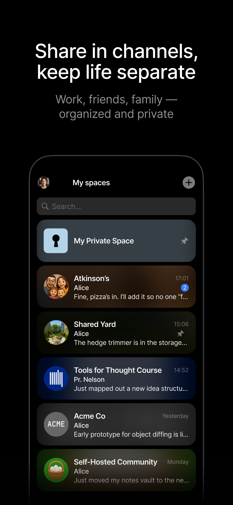
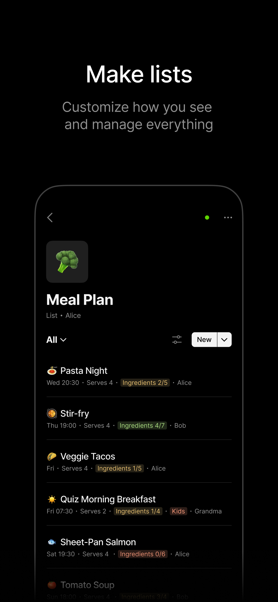
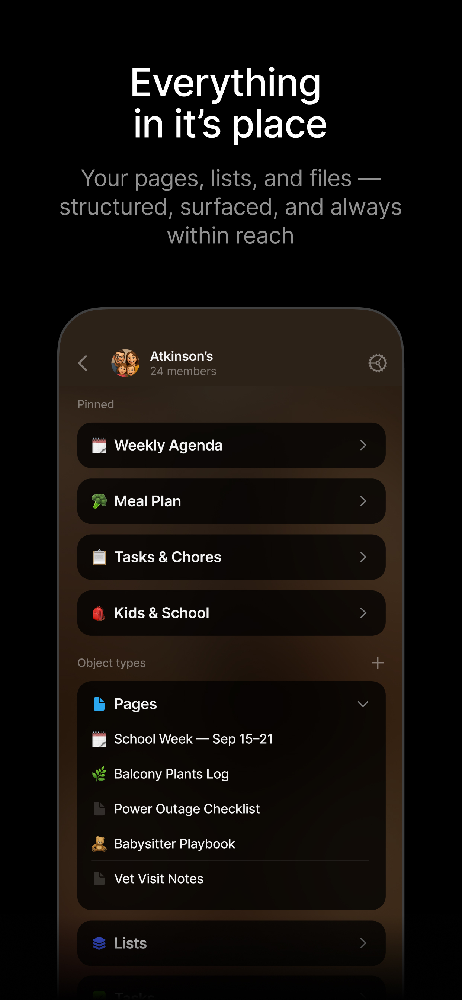

<h1 align="center">Anytype for iOS</h1>

<p align="center">
  Your conversations, docs, notes, files and databases — together in one private app.
  <br>
  End-to-end encrypted. Offline-first. Always yours.
</p>

<p align="center">
  <a href="https://apps.apple.com/app/anytype-private-notes/id6449487029"></a>
  <a href="https://anytype.io"></a>
  <a href="./LICENSE.md"></a>
</p>

---

## Screenshots

<p align="center">
  
  
  
  
  
  
</p>

## Features

**Chats** — Create notes, docs or tasks right from your chat window. Start group conversations with teammates or family, and plan ideas without leaving the chat.

**Spaces** — Organize projects, teams, family or personal areas into docs, lists and databases. Keep secure notes separate from shared work, with clear boundaries for each space.

**And much more:**

- Create pages & notes — from quick memos to long-form documents with media
- Edit with blocks — combine text, tasks or embeds on one page
- Define custom content types — go beyond pages with entities like CV or Research
- Publish to web — share your writing or ideas beyond Anytype
- Manage lists & tasks — from simple todos to complex projects
- Add properties — use Tag, Status, Assignee or create your own fields
- Sort & filter — create custom views to organize content your way
- Use templates — reuse text blocks or bullet lists to speed up writing
- Save bookmarks — keep articles to read later or catalog important links

## Why Anytype?

- **Private by design** — Only you hold the key to your data
- **Yours forever** — Everything is stored on-device and always accessible
- **Seamless sync** — Pick up where you left off across devices
- **Offline first** — Use Anytype anywhere, no internet required
- **Open code** — Explore and contribute at [github.com/anyproto](https://github.com/anyproto)

## Building from Source

### Requirements

- Xcode 16.1+
- Swift Package Manager

### Using pre-built middleware

[`anytype-heart`](https://github.com/anyproto/anytype-heart) is required for a successful build.

1. Create a personal access token [here](https://github.com/settings/tokens) with `read:packages` access ([more info](https://docs.github.com/en/packages/working-with-a-github-packages-registry/working-with-the-apache-maven-registry))
2. Run `make setup-middle` — the script will ask for your `MIDDLEWARE_TOKEN` (your GitHub token)
3. To update the token later: `make change-github-token`

### Building middleware locally

Clone [`anytype-heart`](https://github.com/anyproto/anytype-heart) next to this repo:

```
Parent Directory/
├── anytype-heart/
└── anytype-swift/
```

Configure the Go environment by following instructions in the [`anytype-heart`](https://github.com/anyproto/anytype-heart) repo, then run:

```bash
make setup-middle-local
```

### Updating middleware

Change the version in `Libraryfile` or run:

```bash
make set-middle-version v=v0.37.0
```

## Contribution

Thank you for your desire to develop Anytype together!

This project and everyone involved in it is governed by the [Code of Conduct](docs/CODE_OF_CONDUCT.md).

Check out our [contributing guide](docs/CONTRIBUTING.md) to learn about asking questions, creating issues, or submitting pull requests.

For security findings, please email [security@anytype.io](mailto:security@anytype.io) and refer to our [security guide](docs/SECURITY.md) for more information.

Follow us on [GitHub](https://github.com/anyproto) and join the [Contributors Community](https://github.com/orgs/anyproto/discussions).

---

Made by [Any](https://anytype.io) — a Swiss association 🇨🇭

Licensed under [Any Source Available License 1.0](./LICENSE.md).
